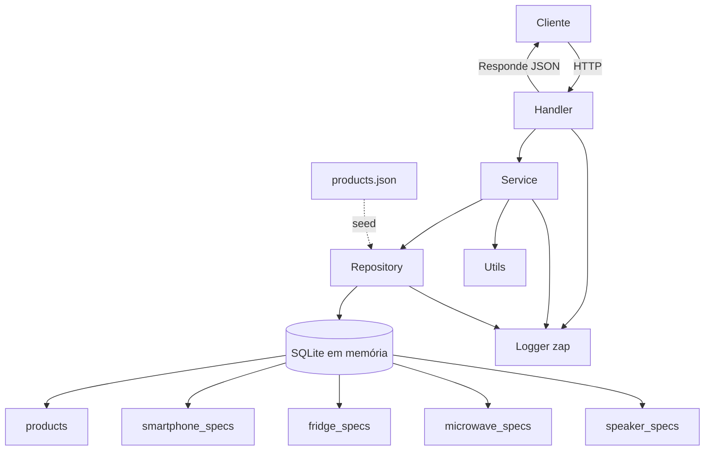

# Diagrama de Arquitetura



# Item Comparison API

API backend em Go para comparação de produtos, seguindo boas práticas de arquitetura, logging estruturado, documentação e testes. Atende requisitos de entrevista técnica e simula persistência com SQLite em memória e seed JSON.

---

## Visão Geral

Esta API permite consultar detalhes de produtos e realizar comparações flexíveis, retornando apenas os campos desejados pelo cliente. O modelo de produto cobre atributos essenciais e permite extensões para especificações especializadas (ex: smartphones).

**Principais características:**
- Filtros multi-valor para marca (`brand`) e cor (`color`)
- Projeção de campos via parâmetro `fields`
- Logging estruturado com níveis (info, warn, error) usando zap
- Tratamento consistente de erros
- Arquitetura modular (handler, service, repository, utils)
- Documentação e exemplos completos

---


## Filtros avançados

Você pode filtrar por múltiplos valores em cada campo (`brand` e `color`), separando-os por vírgula. É possível combinar ambos os filtros no mesmo request:

Exemplo:

```bash
curl "http://localhost:8080/items/compare?brand=Atlas,Nimbus&color=Black,Silver&fields=id,name,price,color,specifications"
```

Esse exemplo retorna todos os produtos das marcas Atlas ou Nimbus e com cor Black ou Silver.

---

## Endpoints

- `GET /health`: health check simples.
- `GET /items/{id}`: retorna um item por ID. Use `fields=...` para limitar os campos retornados.
- `GET /items/compare?brand=...&color=...&fields=...`: retorna múltiplos itens filtrados para comparação.

**Exemplo de erro:**

```json
{
  "error": {
    "message": "item not found",
    "status": 404
  }
}
```


## Modelo de Produto

Campos essenciais (tabela `products`):

| Campo | Tipo | Descrição |
|---|---|---|
| `id` | TEXT (PK) | Identificador único do produto |
| `name` | TEXT | Nome do produto |
| `image_url` | TEXT | URL da imagem |
| `description` | TEXT | Descrição |
| `price` | REAL | Preço |
| `rating` | REAL | Avaliação |
| `size` | TEXT | Dimensões |
| `weight` | TEXT | Peso |
| `color` | TEXT | Cor |
| `type` | TEXT | Tipo (celular, geladeira, etc.) |
| `model` | TEXT | Modelo comercial do produto |

---

## Estrutura do Banco de Dados

O banco SQLite em memória é composto por uma tabela principal e quatro tabelas de especificações especializadas, relacionadas por `product_id`. O campo `model` fica na tabela `products`, evitando duplicar esse dado nas tabelas de especificações.

### `smartphone_specs`

| Campo | Tipo | Descrição |
|---|---|---|
| `product_id` | TEXT (PK/FK) | Referência ao produto |
| `battery_capacity` | TEXT | Capacidade da bateria |
| `camera_specs` | TEXT | Especificações de câmera |
| `memory` | TEXT | Memória RAM |
| `storage_capacity` | TEXT | Armazenamento |
| `brand` | TEXT | Marca |
| `operating_system` | TEXT | Sistema operacional |

### `fridge_specs`

| Campo | Tipo | Descrição |
|---|---|---|
| `product_id` | TEXT (PK/FK) | Referência ao produto |
| `capacity` | TEXT | Capacidade em litros |
| `energy_class` | TEXT | Classificação energética |
| `brand` | TEXT | Marca |

### `microwave_specs`

| Campo | Tipo | Descrição |
|---|---|---|
| `product_id` | TEXT (PK/FK) | Referência ao produto |
| `capacity` | TEXT | Capacidade em litros |
| `power` | TEXT | Potência em Watts |
| `brand` | TEXT | Marca |

### `speaker_specs`

| Campo | Tipo | Descrição |
|---|---|---|
| `product_id` | TEXT (PK/FK) | Referência ao produto |
| `battery_capacity` | TEXT | Autonomia da bateria |
| `connectivity` | TEXT | Conectividade (Bluetooth, etc.) |
| `brand` | TEXT | Marca |

> Índices criados em `color` e `type` na tabela `products`, e em `brand` em todas as tabelas de specs, garantindo buscas eficientes nos filtros do endpoint `/items/compare`.

---

## Decisões Arquiteturais

- Go 1.22, `net/http` para simplicidade e performance
- Persistência simulada: SQLite em memória, seed via JSON
- Logging estruturado com zap (níveis info, warn, error)
- Repository pattern para desacoplamento
- Service layer para lógica de negócio/testabilidade
- Utilitários centralizados (ex: splitAndTrim)
- Testes unitários cobrindo lógica principal
- Documentação e exemplos completos


## Setup e Execução

Pré-requisitos: Go 1.22+

> **Atenção:** este projeto usa `go-sqlite3`, que requer CGO. Sempre execute com `CGO_ENABLED=1`.

```bash
go test ./...
CGO_ENABLED=1 go run ./cmd
```

Porta padrão: `8080`. Para alterar:

```bash
CGO_ENABLED=1 PORT=8080 go run ./cmd
```


## Exemplos de Requisições

```bash
# Buscar um item específico
curl "http://localhost:8080/items/phone-1"

# Comparar todos os produtos das marcas Atlas ou Nimbus
curl "http://localhost:8080/items/compare?brand=Atlas,Nimbus&fields=id,name,price,color,specifications"

# Comparar todos os produtos com cor Black
curl "http://localhost:8080/items/compare?color=Black&fields=name,price,specifications"

# Comparar todos os produtos com cor White
curl "http://localhost:8080/items/compare?color=White&fields=name,price,specifications"

# Comparar todos os produtos da marca Pulse (caixa de som)
curl "http://localhost:8080/items/compare?brand=Pulse&fields=name,price,color,specifications"

# Comparar todos os produtos da marca QuickHeat (micro-ondas)
curl "http://localhost:8080/items/compare?brand=QuickHeat&fields=name,price,color,specifications"

# Comparar todos os produtos das marcas Cooler ou Arctic (geladeiras)
curl "http://localhost:8080/items/compare?brand=Cooler,Arctic&fields=name,price,color,specifications"

# Comparar todos os produtos com cor Silver
curl "http://localhost:8080/items/compare?color=Silver&fields=name,price,specifications"

# Comparar produtos das marcas Atlas ou Nimbus e cor Silver
curl "http://localhost:8080/items/compare?brand=Atlas,Nimbus&color=Silver&fields=name,price,color,specifications"
```

---

## Testes

Execute todos os testes unitários:

```bash
go test ./...
```

---

## Observações

- Logging estruturado (zap) já configurado, com níveis e campos para fácil integração com sistemas de monitoramento.
- O projeto pode ser facilmente estendido para outros tipos de produtos e filtros.
- Todos os requisitos funcionais e não-funcionais do desafio estão cobertos.